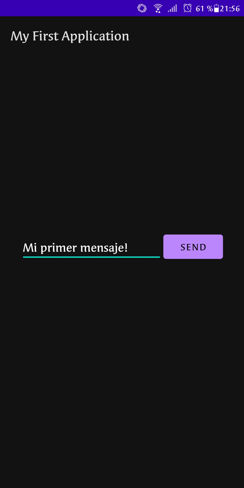
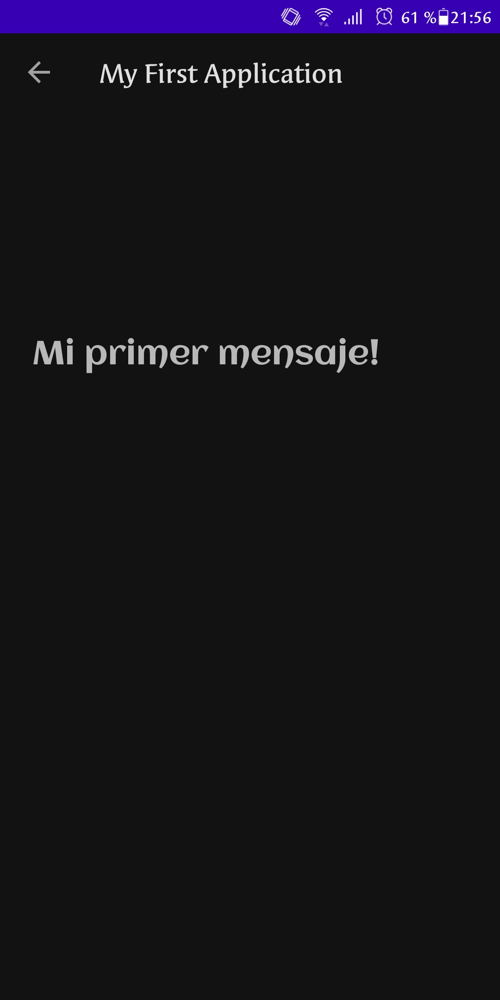

# IETI-LAB11

## Enunciado
La guía del laboratorio está disponible [aquí](https://developer.android.com/training/basics/firstapp/).

## Autor
Johann Sebastian Páez Campos - Laboratorio 11 IETI 12/11/2020

## Mi primera aplicación

Esta es mi primera aplicación en android, ingrese su mensaje y luego se mostrará en otra vista.

### Ejemplo

